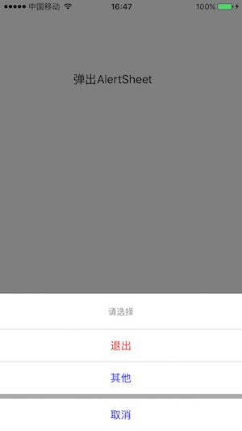

# AlertSheet

## useage:

```swift
let items = [AlertSheetItem(title: "退出", style: .special), AlertSheetItem(title: "其他", style: .light)]
let sheet = AlertSheet.actionSheet(title: "请选择", cancelItemTitle: "取消", otherItemTitles: items)
sheet.didClickedItemAtIndexHandler = { (rowIndex) in
    NSLog("didClicked Item at \(rowIndex)")
}
sheet.didClickedCancelHandler = {
    NSLog("didClicked Cancel")
}
sheet.show()
```




