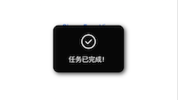

# TGCToastView

## useage:

```swift
@IBAction func onShowToastView(sender: UIButton) {
    // Toast框体自动适配高度，默认停留3秒
    self.view.tgc_makeToast("显示消息！\n这个是测试的消息")
}
```


```swift
@IBAction func onShowToastImageView(sender: UIButton) {
    // 加入自定义的图片
    self.view.tgc_makeToast("任务已完成！", image: UIImage(named: "ok")!, duration: 1)
}
```



```swift
@IBAction func onShowToastErrorView(sender: UIButton) {
    let navigationHeight: CGFloat = (self.navigationController?.navigationBar.frame.height)!
    let barHeight: CGFloat = UIApplication.sharedApplication().statusBarFrame.height
    // 默认冲最顶部显示（如果有导航栏将被遮挡）
    self.view.tgc_makeErrorToast("显示一个错误消息！", originBottomPosY: navigationHeight + barHeight)
}
```


