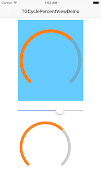

# TGCyclePercentView

```
// #1
@IBOutlet weak var percentView: TGCyclePercentView!
@IBOutlet weak var sliderView: UISlider!

@IBAction func onPercentChange(sender: UISlider) {
    percentView.progress = sender.value / sender.maximumValue
    cycleView.progress = sender.value / sender.maximumValue
}
override func viewDidLoad() {
    super.viewDidLoad()

    // #2
    cycleView = TGCyclePercentView()
    cycleView.frame = CGRectMake(sliderView.frame.origin.x, sliderView.frame.origin.y + sliderView.frame.height + 20, 200, 200)
    cycleView.backgroundColor = UIColor.whiteColor()
    self.view.addSubview(cycleView)

    let startValue = sliderView.value / sliderView.maximumValue
    percentView.progress = startValue
    cycleView.progress = startValue
}
```



