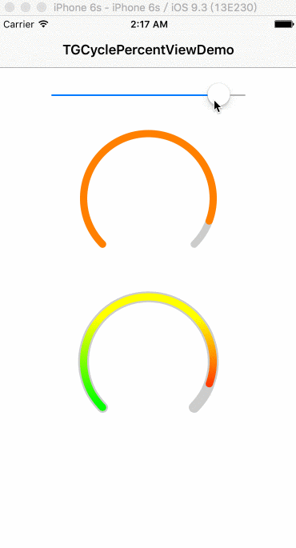

# TGCyclePercentView

```
// #1
@IBOutlet weak var cycleView1: TGCyclePercentView!
@IBOutlet weak var cycleView2: TGCyclePercentView2!
@IBOutlet weak var sliderView: UISlider!

@IBAction func onPercentChange(sender: UISlider) {
    cycleView1.progress = sender.value / sender.maximumValue
    cycleView2.progress = sender.value / sender.maximumValue
}
override func viewDidLoad() {
    super.viewDidLoad()

    let startValue = sliderView.value / sliderView.maximumValue
    cycleView1.progress = startValue
    cycleView2.progress = startValue
}
```



