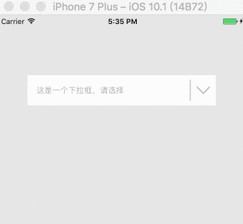

使用方法：

```swift
override func viewDidLoad() {
    super.viewDidLoad()

    self.view.backgroundColor = UIColor(red: 0.9, green: 0.9, blue: 0.9, alpha: 1)

    let defaultTitle = "这是一个下拉框，请选择"
    let choices = ["第一个选项", "第二个选项", "第三个选项", "第四个选项"]
    let rect = CGRect(x: 50, y: 100, width: self.view.frame.width - 100, height: 50)
    let dropBoxView = TGDropBoxView(parentVC: self, title: defaultTitle, items: choices, frame: rect)
    dropBoxView.isHightWhenShowList = true
    dropBoxView.willShowOrHideBoxListHandler = { (isShow) in
        if isShow { NSLog("will show choices") }
        else { NSLog("will hide choices") }
    }
    dropBoxView.didShowOrHideBoxListHandler = { (isShow) in
        if isShow { NSLog("did show choices") }
        else { NSLog("did hide choices") }
    }
    dropBoxView.didSelectBoxItemHandler = { (row) in
        NSLog("selected No.\(row): \(dropBoxView.currentTitle())")
    }
    self.view.addSubview(dropBoxView)
}
```

运行效果：




