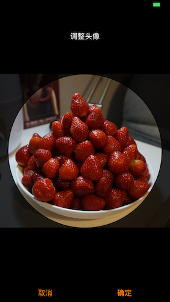

PhotoEditViewController 用来将选中图片作为头像进行剪切，生成正方形图片（显示时需要再裁剪成圆形）

FixOrientation 用来调整拍摄照片的方向

### 使用实例

```
NotificationCenter.default.addObserver(self, selector: #selector(onListenPickedImg(sender:)), name: PhotoEditViewController.pickedNotiName, object: nil)

@objc fileprivate func onListenPickedImg(sender: Notification) {
        let usrInfo = sender.userInfo as! [String: UIImage]
        self.imgview.image = usrInfo["image"]
    }

func imagePickerController(_ picker: UIImagePickerController, didFinishPickingMediaWithInfo info: [String : Any]) {
    let image = (info as NSDictionary).object(forKey: UIImagePickerControllerOriginalImage) as! UIImage
    
    let editVC = PhotoEditViewController(img: image)
    editVC.superViewController = picker
    picker.present(editVC, animated: false, completion: nil)
}
```

